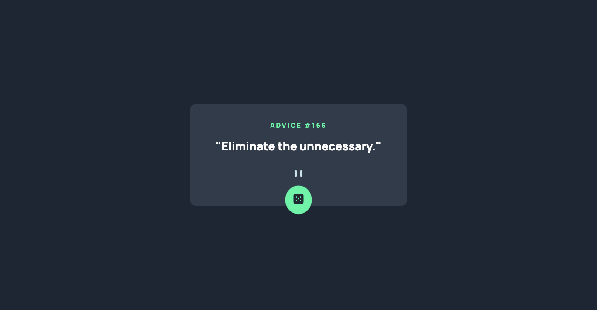
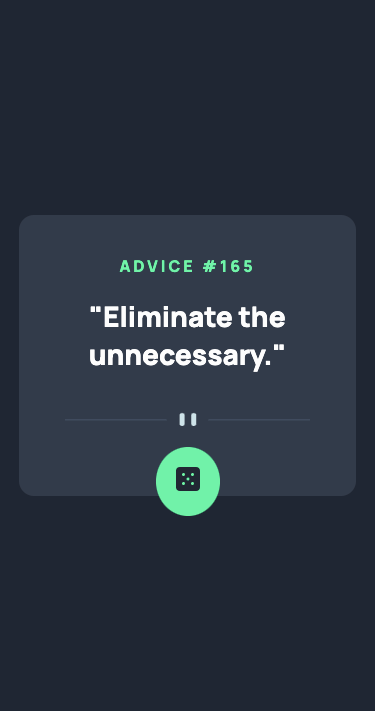

# Frontend Mentor - Advice generator app solution

This is a solution to the [Advice generator app challenge on Frontend Mentor](https://www.frontendmentor.io/challenges/advice-generator-app-QdUG-13db). Frontend Mentor challenges help you improve your coding skills by building realistic projects.

## Table of contents

- [Overview](#overview)
  - [The challenge](#the-challenge)
  - [Screenshot](#screenshot)
  - [Links](#links)
- [My process](#my-process)
  - [Built with](#built-with)
  - [What I learned](#what-i-learned)
  - [Continued development](#continued-development)
  - [Useful resources](#useful-resources)
- [Author](#author)
- [Acknowledgments](#acknowledgments)

## Overview

### The challenge

Users should be able to:

- Use 3rd-party Advice Slip API to generate random quotes of advice
- View the optimal layout for the component depending on their device's screen size

### Screenshot




### Links

- Solution URL: [Add solution URL here](https://your-solution-url.com)
- Live Site URL: [Github Page](https://adrianna-thomas.github.io/advice-generator-app/)

## My process

### Built with

- Semantic HTML5 markup
- CSS custom properties
- Flexbox
- CSS Grid
- Mobile-first workflow

### What I learned

I learned how to create placeholders for the json data by using the span tag and setting the element ID for the advice DIV.

```html
<h1>Advice #<span id="adviceId"></span></h1>
<div class="advice" id="adviceText"></div>
>
```

I learned how to center the button at the bottom of the div container.

```css
.btn {
  position: absolute;
  left: 50%;
  bottom: -1rem;
  transform: translateX(-50%);
}
```

I learned how to add quotes around the pulled advice text from the json data.

```js
adviceText.innerHTML = `<p>"${advice}"</p>`;
```

### Continued development

Get more comfortable using APIs.

### Useful resources

- [How to use 3rd-Party API with JS](https://javascript.plainenglish.io/how-to-call-and-use-third-party-apis-in-vanilla-javascript-with-a-full-example-da44b095da03) - This article helped understand the steps for using 3rd-party APIs with Javascript.
- [Advice Slip API](https://api.adviceslip.com/) - This was the source for performing the project.

## Author

- Frontend Mentor - [@adrianna-thomas](https://www.frontendmentor.io/profile/adrianna-thomas)

## Acknowledgments

1. [Mr Coder Youtube](https://www.youtube.com/watch?v=ipTfXOXBCoQ&ab_channel=MrCoder) - Helped me understand how to fetch the API and apply it to my javascript.
